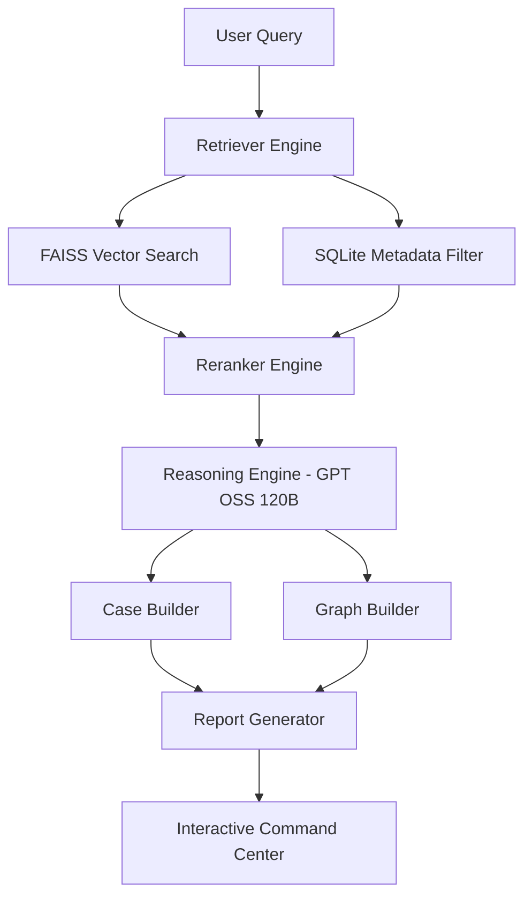

# Infraglyph UFDR: Unified Forensic Data Retriever


**Infraglyph UFDR** is a premium, autonomous forensic intelligence platform designed to bridge the chasm between massive telemetry data and actionable forensic truth. Using advanced RAG (Retrieval-Augmented Generation) and Agentic reasoning, it automates the process of evidence retrieval, case building, and investigative reporting.

---

## Project Team: Infraglyph Unit 01
*   **Urvi Kava**
*   **Harsh Patel**
*   **Prisha Khalasi**
*   **Aman Choudhary**

---

## Problem Statement
In modern digital forensics, investigators are overwhelmed by **massive telemetry gaps**. Analyzing millions of log entries—ranging from login attempts to file transfers—to find a single thread of malicious activity is like searching for a needle in a haystack. Manual analysis is slow, prone to error, and cannot scale with enterprise data.

**UFDR** solves this by providing an autonomous reasoning engine that:
1.  Ingests massive forensic datasets.
2.  Semantically retrieves relevant evidence.
3.  Synthesizes comprehensive, grounded investigative reports.
4.  Maps the entire attack surface topology automatically.

---

## System Architecture
The UFDR system follows a sophisticated **"Retrieve -> Rerank -> Reason -> Report"** pipeline.



### Core Components:
*   **Retriever Engine**: Combines FAISS (vector-based semantic search) with SQLite (metadata-based filtering) to extract high-signal evidence.
*   **Reranker (Cross-Encoder)**: Performs deep contextual scoring to ensure only the most relevant evidence reaches the reasoning stage.
*   **Reasoning Engine**: A "Senior Digital Forensics Investigator" AI (using GPT-OSS 120b) that performs clinical evidence evaluation, risk scoring, and threat categorization.
*   **Case & Graph Builder**: Automatically identifies subjects of interest, builds timelines, and generates Mermaid-based topological attack maps.
*   **Command Center (Web App)**: A high-fidelity React/Vite interface featuring glassmorphism, interactive graphs, and a real-time interrogation chat.

---

## Setup & Installation

### Prerequisites
*   **Python 3.10+**
*   **Node.js 18+**
*   **Ollama** (for local reasoning) or **Ollama Cloud API Key**
*   **Git**

### 1. Clone the Repository
```bash
git clone https://github.com/harshpatel080503/UFDR-REPORT.git
cd UFDR
```

### 2. Backend Configuration (Python)
Create a virtual environment and install the required forensic libraries:
```powershell
python -m venv venv
.\venv\Scripts\activate
pip install -r Indexing/requirements.txt
pip install -r Evaluation/requirements_eval.txt
pip install fastapi uvicorn python-dotenv requests
```

### 3. Environment Variables
Create a `.env` file in the root directory:
```env
OLLAMA_API_KEY=your_api_key_here
OLLAMA_CLOUD_URL=https://your-ollama-endpoint.com
# Optional: Add any other model specific keys
```

### 4. Frontend Configuration (Node.js)
```bash
cd ufdr-web-app
npm install
```

---

## Data Setup & Indexing
Before running the command center, you must process the raw forensic data and build the search indexes.

### 1. Process Raw Forensic Data
Convert raw CSV telemetry into optimized JSONL formats:
```powershell
python "Data Preparation/data_pipeline.py"
```

### 2. Enhance for Page Indexing
Enrich the JSONL files with time features, mapped actions, and unique `page_id` identifiers:
```powershell
python "Data Preparation/enhancing_to_pageindex.py"
```

### 3. Run the Indexing Pipeline
This is a three-phase process that builds the database, generates embeddings, and constructs the FAISS search index.
```powershell
# To run all phases (Recommended)
python Indexing/pipeline.py --phase all

# Or run specific phases:
# python Indexing/pipeline.py --phase pageindex  # Metadata DB
# python Indexing/pipeline.py --phase embed      # Vector Embeddings
# python Indexing/pipeline.py --phase faiss      # Search Indexes
```

---

## Running the Project

### 1. Launch the Backend Server
From the project root:
```bash
python web_server.py
```
This starts the FastAPI server on `http://localhost:8000`.

### 2. Launch the Interactive Command Center
From the `ufdr-web-app` directory:
```bash
npm run dev
```
Open `http://localhost:5173` in your browser to access the UFDR Command Center.

### 3. Run a Full Pipeline via CLI (Optional)
To run a direct investigation from the terminal:
```bash
python full_pipeline.py "Investigate suspicious data exfiltration for user FEB0306"
```

---

## Output & Evidence
*   **Investigative Dossiers**: Full Markdown reports synthesized from logs.
*   **Attack Topology**: Interactive Mermaid graphs visualizing entity relationships.
*   **Risk Scoring**: Dynamic threat levels (0-10) assigned by the Reasoning Engine.

---
*© 2026 Infraglyph Unit // Global Response Force // TS/SCI Clearance Required*
