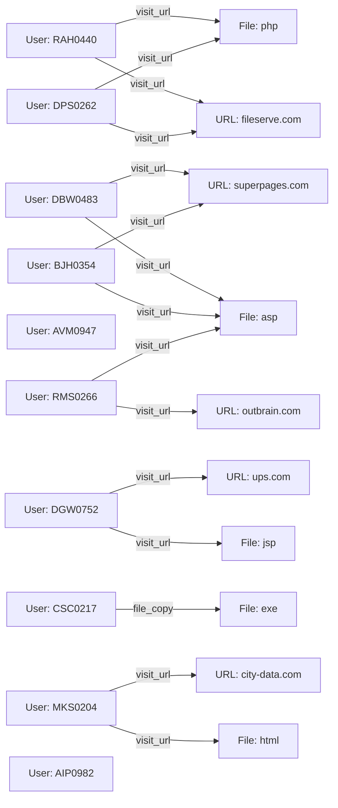

# UFDR Copilot - Forensic Investigation Report
**Report ID**: `UFDR-20260416-002604` | **Date**: 2026-04-16 00:26:04
**Target Query**: `unusual data download from suspicious url`

---

## 1. Executive Summary
Automated reasoning failed. Manual review required. Error: HTTPConnectionPool(host='localhost', port=11434): Read timed out. (read timeout=180)

**Overall Risk Score**: `[5/10]`
**Threat Category**: `Error`

### AI Analysis (DeepSeek-R1)
> [!NOTE]
> This analysis was generated using Chain-of-Thought reasoning.
> **Total Reasoning Time**: 0.00s

### Key Findings
- System error occurred during inference.

---

## 2. Entity Relationship Graph

---

## 3. Investigation Subjects
The retriever identified `10` potential subjects of interest.

### Subject 1: BJH0354
- **Events Detected**: 1
- **Primary Action**: `visit_url`
- **Activity Timeline**: 2010-04-05 to 2010-04-05

| Timestamp | Action | Evidence Snippet | Source |
|---|---|---|---|
| 2010-04-05 | visit_url | BJH0354 visited http://superpages.com/Albatross/diomedea/uverfgeratgugenvavatzhf... | http_2010-04 |

---
### Subject 2: CSC0217
- **Events Detected**: 1
- **Primary Action**: `file_copy`
- **Activity Timeline**: 2010-06-10 to 2010-06-10

| Timestamp | Action | Evidence Snippet | Source |
|---|---|---|---|
| 2010-06-10 | file_copy | CSC0217 accessed 6UQIYOYG.exe content 4D-5A-90-00-03-00-00-00-04-00-00-00-FF-FF-... | non_http |

---
### Subject 3: RMS0266
- **Events Detected**: 1
- **Primary Action**: `visit_url`
- **Activity Timeline**: 2010-02-19 to 2010-02-19

| Timestamp | Action | Evidence Snippet | Source |
|---|---|---|---|
| 2010-02-19 | visit_url | RMS0266 visited http://outbrain.com/Haflinger/whf/tneqravatobbxfuhagvattnzrpnyyf... | http_2010-02 |

---
### Subject 4: RAH0440
- **Events Detected**: 1
- **Primary Action**: `visit_url`
- **Activity Timeline**: 2010-02-01 to 2010-02-01

| Timestamp | Action | Evidence Snippet | Source |
|---|---|---|---|
| 2010-02-01 | visit_url | RAH0440 visited http://fileserve.com/GRB_970508/afterglow/ybtvpobneqbsqverpgbefg... | http_2010-02 |

---
### Subject 5: DPS0262
- **Events Detected**: 1
- **Primary Action**: `visit_url`
- **Activity Timeline**: 2010-02-12 to 2010-02-12

| Timestamp | Action | Evidence Snippet | Source |
|---|---|---|---|
| 2010-02-12 | visit_url | DPS0262 visited http://fileserve.com/GRB_970508/afterglow/ybtvpobneqbsqverpgbefg... | http_2010-02 |

---
### Subject 6: AIP0982
- **Events Detected**: 1
- **Primary Action**: `file_copy`
- **Activity Timeline**: 2010-02-04 to 2010-02-04

| Timestamp | Action | Evidence Snippet | Source |
|---|---|---|---|
| 2010-02-04 | file_copy | AIP0982 accessed URAZVIO6.jpg content FF-D8... | non_http |

---
### Subject 7: AVM0947
- **Events Detected**: 1
- **Primary Action**: `file_copy`
- **Activity Timeline**: 2010-05-07 to 2010-05-07

| Timestamp | Action | Evidence Snippet | Source |
|---|---|---|---|
| 2010-05-07 | file_copy | AVM0947 accessed URGQD0QH.jpg content FF-D8... | non_http |

---
### Subject 8: DBW0483
- **Events Detected**: 1
- **Primary Action**: `visit_url`
- **Activity Timeline**: 2010-01-21 to 2010-01-21

| Timestamp | Action | Evidence Snippet | Source |
|---|---|---|---|
| 2010-01-21 | visit_url | DBW0483 visited http://superpages.com/Albatross/diomedea/uverfgeratgugenvavatzhf... | http_2010-01 |

---
### Subject 9: MKS0204
- **Events Detected**: 1
- **Primary Action**: `visit_url`
- **Activity Timeline**: 2010-02-22 to 2010-02-22

| Timestamp | Action | Evidence Snippet | Source |
|---|---|---|---|
| 2010-02-22 | visit_url | MKS0204 visited http://city-data.com/No_Way_Out_2004/hotty/sregvyvmreaba-svpgvba... | http_2010-02 |

---
### Subject 10: DGW0752
- **Events Detected**: 1
- **Primary Action**: `visit_url`
- **Activity Timeline**: 2010-03-26 to 2010-03-26

| Timestamp | Action | Evidence Snippet | Source |
|---|---|---|---|
| 2010-03-26 | visit_url | DGW0752 visited http://ups.com/John_Dee/ficino/fcbegfyrnthrsnfvbauvxvatobbgfzbgb... | http_2010-03 |

---

## 4. Conclusion & Recommendations
Based on the evidence retrieved and analyzed, further investigation into the flagged entities is recommended. 
The high-risk scores indicated in Section 1 suggest immediate forensic triage of the associated devices.

---
*Generated by UFDR Copilot System*
