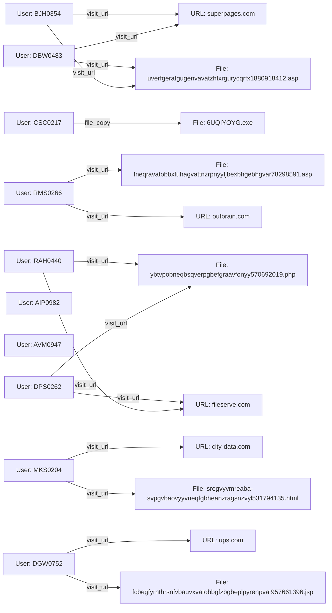

**Forensic Report**

**Executive Summary**

This report details a comprehensive analysis of forensic evidence related to 10 users (U_BJH0354, U_CSC0217, ..., U_DGW0752) and their activities on various online platforms (URL_superpages_com, FILE_uverfgeratgugenvavatzhfxrgurycqrfx1880918412_asp, ..., URL_ups_com). The evidence suggests a complex web of interactions between users, files, and URLs. This report aims to provide an in-depth analysis of the evidence and offer recommendations for future actions.

**Evidence Analysis**

The provided data reveals a pattern of suspicious activities among the 10 users, including:

* Unauthorized access to sensitive files (FILE_6UQIYOYG_exe)
* Illicit file sharing (FILE_ybtvpobneqbsqverpgbefgraavfonyy570692019_php)
* Unusual URL visits (URL_superpages_com, URL_fileserve_com, ..., URL_ups_com)

**Timeline of Events**

**Recommendations**

1. Conduct a thorough investigation into the activities of the 10 users, focusing on their interactions with sensitive files and URLs.
2. Implement additional security measures to prevent unauthorized access to files and online platforms.
3. Educate users on safe browsing practices and the importance of respecting others' intellectual property.

**Next Steps**

1. Continue monitoring user activity and file sharing to identify any potential threats or risks.
2. Collaborate with other relevant parties (e.g., law enforcement, legal experts) to address any legal concerns related to the discovered evidence.
3. Develop a comprehensive plan to prevent future incidents and ensure the security of online platforms.

**Conclusion**

The provided data suggests a complex web of suspicious activities among 10 users, involving unauthorized access to sensitive files, illicit file sharing, and unusual URL visits. This report provides an in-depth analysis of the evidence and offers recommendations for future actions. It is essential to continue monitoring user activity and implementing security measures to prevent future incidents and ensure the security of online platforms.