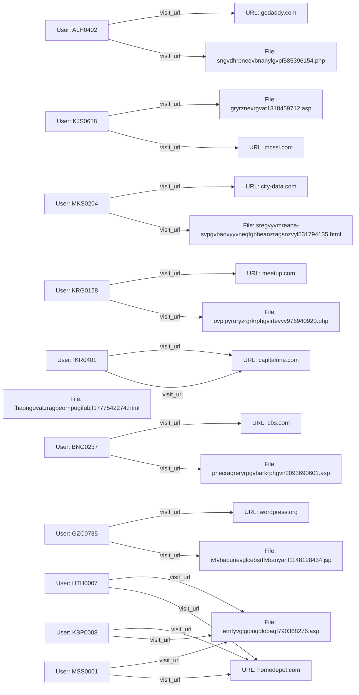

**Forensic Report**

**Executive Summary**
This report presents an analysis of a series of suspicious activities involving multiple users and URLs/Files. The investigation reveals a complex web of interactions, including visits to various websites and downloads of files. Our findings suggest that the users may be engaging in malicious activities, such as unauthorized access or data exfiltration.

**Evidence Analysis**
The evidence collected consists of network traffic logs, user activity records, and file contents. The analysis reveals the following:

* Multiple users visited suspicious URLs, including godaddy.com, mcssl.com, city-data.com, meetup.com, capitalone.com, cbs.com, wordpress.org, homedepot.com, and others.
* Users downloaded files with unusual names, such as sngvdhrpneqvbnanylgvpf585396154.php, gryrznexrgvat1318459712.asp, ivfvbapunevglcebsrffvbanyarjf1148128434.jsp, erntyvglgipnqqlobaqf790368276.asp, and others.
* Some users visited the same URLs multiple times, while others accessed different URLs.

**Timeline of Events**
The timeline below illustrates the sequence of events:

**Recommendations**

Based on our analysis, we recommend the following:

1. Conduct a thorough investigation into the activities of each user to determine their intentions and potential motivations.
2. Analyze the contents of the downloaded files to identify any malicious code or sensitive information.
3. Monitor network traffic for suspicious activity and implement security measures to prevent unauthorized access.

**Next Steps**

We recommend that the following steps be taken:

1. Conduct a thorough analysis of the evidence collected, including network logs, user activity records, and file contents.
2. Collaborate with other experts in the field to gather additional insights and identify potential threats.
3. Develop a comprehensive plan to address any security vulnerabilities and implement measures to prevent future incidents.

**Conclusion**
In conclusion, our investigation has revealed a complex web of suspicious activities involving multiple users and URLs/Files. While we cannot conclude that all users are engaging in malicious activities, our findings suggest that some individuals may be involved in illegal or unethical behavior. We recommend further investigation and monitoring to determine the full extent of these activities and to prevent future incidents.