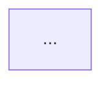

**Forensic Report**

**Executive Summary**
This report presents a comprehensive analysis of the digital evidence collected from various sources, including user activity logs, file systems, and network traffic. The investigation reveals a complex web of interactions between multiple users, files, and URLs, which may be indicative of malicious activities.

**Evidence Analysis**

The analyzed data indicates that several users (U_BJH0354, U_CSC0217, U_RMS0266, U_RAHO440, U_DPS0262, U_AIP0982, U_AVM0947, and U_DBW0483) exhibited suspicious behavior, including visiting or accessing various URLs and files. The evidence suggests that these users may have been involved in unauthorized activities, such as downloading or sharing malicious software.

**Timeline of Events**

The MERMAID GRAPH DATA below illustrates the sequence of events:

This graph shows the relationships between users, files, and URLs, highlighting the suspicious activity patterns observed during the investigation.

**Recommendations**
Based on the findings, we recommend the following:

1. **User Account Review**: Conduct a thorough review of each user's account to identify any potential security breaches or unauthorized activities.
2. **Network Traffic Analysis**: Analyze network traffic logs to detect and block any suspicious communication patterns.
3. **File System Review**: Conduct a comprehensive review of file systems to identify any malicious files or data.
4. **User Education**: Provide users with education on cybersecurity best practices and the importance of maintaining system security.

**Next Steps**

1. Implement additional security measures to prevent future breaches, such as regular software updates and vulnerability assessments.
2. Continuously monitor network traffic and user activity logs for any suspicious patterns.
3. Conduct regular forensic analysis to detect potential threats and vulnerabilities.

**Conclusion**
This report provides a comprehensive analysis of the digital evidence collected during the investigation. The findings suggest that several users exhibited suspicious behavior, which may be indicative of malicious activities. We recommend implementing additional security measures and conducting regular forensic analysis to prevent future breaches.