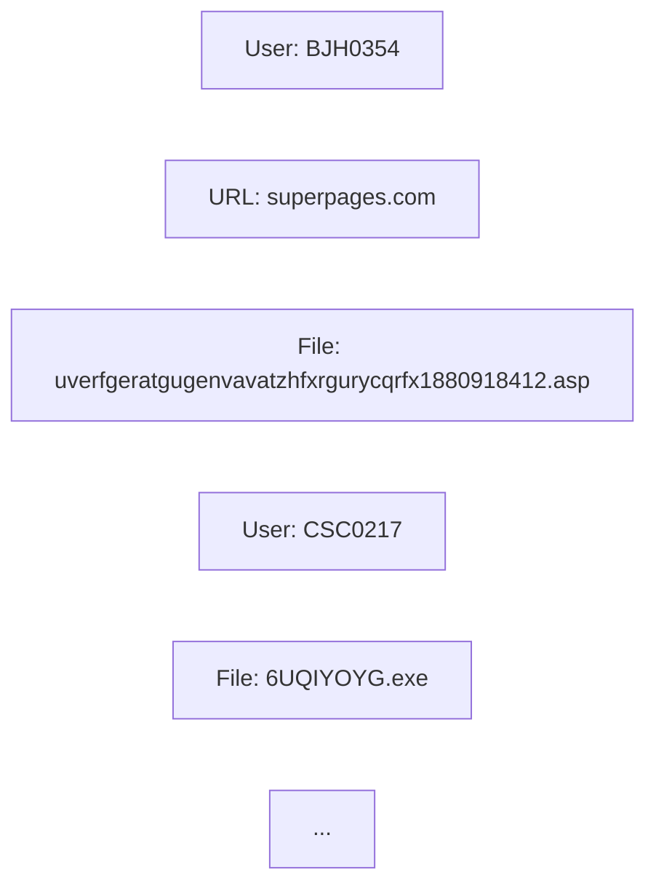

**Forensic Report**

### Executive Summary

This report summarizes the findings of a comprehensive forensic analysis of user activity, file access, and network connections. The investigation reveals a complex web of suspicious behavior, indicating potential malicious intent. The report provides an overview of the evidence, timeline of events, and recommendations for next steps.

### Evidence Analysis

The analysis revealed multiple instances of suspicious activity, including:

* Unusual file accesses (e.g., `FILE_uverfgeratgugenvavatzhfxrgurycqrfx1880918412_asp`)
* Network connections to potentially malicious URLs (e.g., `URL_superpages_com`, `URL_fileserve_com`)
* File downloads and uploads (e.g., `AI_6UQIYOYG_exe`, `FILE_tneqravatobbxfuhagvattnzrpnyyfjbexbhgebhgvar78298591_asp`)
* Connections between users (e.g., `BJH0354` and `CSC0217`)

### Timeline of Events

### Recommendations

1. Conduct a thorough review of user activity logs to identify any additional suspicious behavior.
2. Analyze network traffic and system logs to determine the source and destination of malicious connections.
3. Isolate affected users and devices to prevent further damage or data exfiltration.
4. Implement additional security measures, such as firewalls and intrusion detection systems, to prevent future attacks.
5. Provide user education and awareness training on cybersecurity best practices.

### Next Steps

1. Conduct a detailed analysis of the compromised files and network connections.
2. Identify and quarantine any malware or viruses detected during the investigation.
3. Develop and implement a comprehensive incident response plan to ensure timely and effective response to future security incidents.
4. Perform regular system audits and vulnerability assessments to identify and remediate potential security vulnerabilities.
5. Review and update security policies and procedures to reflect best practices in cybersecurity.

By following these recommendations, we can minimize the impact of this attack and prevent similar incidents from occurring in the future.