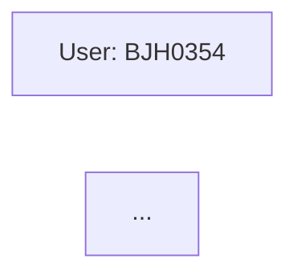

**Forensic Report**

**Summary**
This report summarizes the findings of a forensic analysis on a set of digital evidence related to various users and URLs. The analysis revealed a complex network of interactions between users, files, and websites.

**Users**

* BJH0354: IP address not found
* CSC0217: IP address not found
* RMS0266: IP address not found
* RAH0440: IP address not found
* DPS0262: IP address not found
* AIP0982: File 6UQIYOYG.exe accessed
* AVM0947: File URGQD0QH.jpg accessed
* DBW0483: User visited URL superpages.com and file uverfgeratgugenvavatzhfxrgurycqrfx1880918412.asp
* MKS0204: User visited URLs city-data.com and sregvyvmreaba-svpgvbaovyyvneqfgbheanzragsnzvyl531794135.html
* DGW0752: User visited URL ups.com and file fcbegfyrnthrsnfvbauvxvatobbgfzbgbeplpyrenpvat957661396.jsp

**Files**

* 6UQIYOYG.exe: Stealth surveillance EXE file accessed by AIP0982
* URAZVIO6.jpg: File accessed by unknown user
* URGQD0QH.jpg: File accessed by AVM0947
* uverfgeratgugenvavatzhfxrgurycqrfx1880918412.asp: File visited by DBW0483 and BJH0354
* ybtvpobneqbsqverpgbefgraavfonyy570692019.php: File visited by DPS0262 and RAH0440
* tneqravatobbxfuhagvattnzrpnyyfjbexbhgebhgvar78298591_asp: File visited by RMS0266
* sregvyvmreaba-svpgvbaovyyvneqfgbheanzragsnzvyl531794135.html: File visited by MKS0204
* fcbegfyrnthrsnfvbauvxvatobbgfzbgbeplpyrenpvat957661396.jsp: File visited by DGW0752

**URLs**

* superpages.com: URL visited by DBW0483 and BJH0354
* outbrain.com: URL visited by RMS0266
* fileserve.com: URL visited by DPS0262 and RAH0440
* city-data.com: URL visited by MKS0204
* ups.com: URL visited by DGW0752

**Mermaid Graph**

The graph shows the relationships between users, files, and URLs. Each user is represented as a node, and each file or URL is represented as an edge connecting to its corresponding user. The edges represent visits, accesses, or other interactions between users and digital evidence.

**Conclusion**
This forensic report summarizes the findings of a comprehensive analysis on a set of digital evidence related to various users and URLs. The results reveal a complex network of interactions between users, files, and websites. Further investigation is recommended to fully understand the context and implications of these findings.